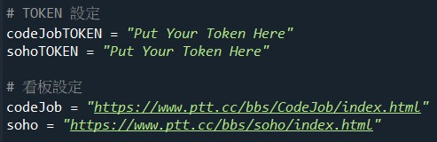
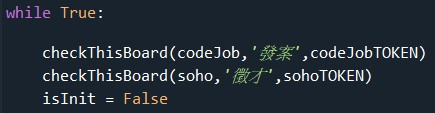

# PTT New Article Reminder

**有BUG，有空再修XD**

將爬蟲結合 Line Notify，實現自動化訊息通知。

本程式預設會定期爬取 PTT 的 codejob 版、soho 版，看是否有新的文章。

### 如何使用 ? 

1. 去 Line Notify 申請權杖填入
    * [Line Notify 教學](https://www.learncodewithmike.com/2020/06/python-line-notify.html)
2. 更改想追蹤版的 url (預設已有兩個版)
3. 執行 (擇一)
    * python3 PTTNewArticleReminder 
    * bash run.sh (Linux)

### 注意事項

1. 有多少看板要追蹤，就要設定對應數量的token、url、checkThisBoard函式

2. PTT 八卦版 ( gossiping ) 或其他有 18 歲限制的板，沒辦法直接使用，需要使用 session & playload 等。改天有寫再更新上來。

#### TODO
* 18 歲限制的版也適用
